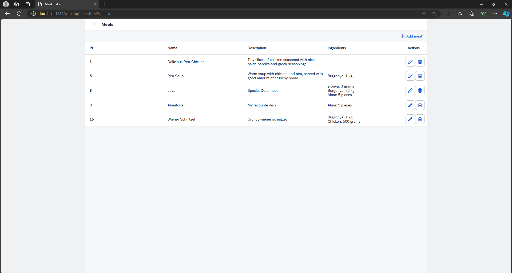

# SAPUI5 Meal Maker Project

This project is a simple SAPUI5 application that uses AZURE REST APIs to manage meal data. The main screen of the app contains three buttons, each leading to a different page with specific functions.

One of the main pages is the Meal Page. This page shows a table of meals, and for each meal, it displays a list of ingredients. Users can add new meals or delete existing ones using navigation buttons on the right side of the table.

To add a new meal, the user clicks the "Add Meal" button. This action opens a fragment window where the user can enter meal details. In this window, there's a "Select Ingredient" button. 

When clicked, it opens a selection dialog fragment. In this dialog, users can search for ingredients and select multiple items for the meal. 
After choosing the ingredients, the user returns to the add meal window. Here, they can specify the amount for each ingredient and choose the unit of measurement.
The deletion process is straightforward. Users click a delete button next to a meal, confirm their choice, and the app removes the meal from both the table and the database.
For better performance, the app loads meal data in small batches. It also uses client-side filtering for the ingredient search, which makes the search process faster.

The ingredient table contain same fucntionality.

